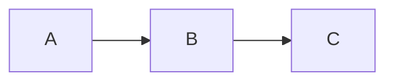
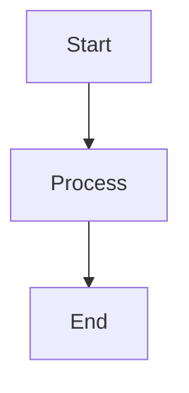

# API Reference - Markdown Flow UI

This document provides comprehensive API documentation for all components, hooks, and utilities in the Markdown Flow UI library.

## 📚 Table of Contents

- [Core Components](#core-components)
  - [MarkdownFlow](#markdownflow)
  - [ScrollableMarkdownFlow](#scrollablemarkdownflow)
  - [ContentRender](#contentrender)
  - [MarkdownFlowEditor](#markdownfloweditor)
- [Hooks](#hooks)
  - [useTypewriter](#usetypewriter)
  - [useScrollToBottom](#usescrolltobottom)
  - [useSSE](#usesse)
- [Types and Interfaces](#types-and-interfaces)
- [Plugins](#plugins)
- [Utilities](#utilities)

## 🧩 Core Components

### MarkdownFlow

The main component for rendering markdown content with typewriter effects in a conversational flow format.

```tsx
import { MarkdownFlow } from 'markdown-flow-ui';
```

#### Props

```typescript
interface MarkdownFlowProps {
  initialContentList?: ContentItem[];
  customRenderBar?: CustomRenderBarProps;
  onSend?: (content: OnSendContentParams) => void;
  typingSpeed?: number;
  disableTyping?: boolean;
  onBlockComplete?: (blockIndex: number) => void;
}
```

##### `initialContentList` (optional)

An array of content items to display in the flow.

```typescript
type ContentItem = {
  content: string;                    // Markdown content to render
  isFinished?: boolean;              // Whether this block is complete
  defaultInputText?: string;         // Default text for input fields
  defaultButtonText?: string;        // Default text for buttons
  readonly?: boolean;                // Whether interactive elements are read-only
  customRenderBar?: CustomRenderBarProps; // Custom render bar for this block
}
```

**Example:**
```tsx
const contentList = [
  {
    content: "# Welcome!\n\nChoose your language: ?[%{{language}} English | Spanish | French]",
    isFinished: false
  },
  {
    content: "Great choice! Let's continue...",
    isFinished: true
  }
];

<MarkdownFlow initialContentList={contentList} />
```

##### `customRenderBar` (optional)

A custom component to render additional UI elements.

```typescript
type CustomRenderBarProps = React.ComponentType<{
  content?: string;
  onSend?: (content: OnSendContentParams) => void;
  displayContent: string;
}>
```

##### `onSend` (optional)

Callback function called when user interacts with buttons or inputs.

```typescript
type OnSendContentParams = {
  buttonText?: string;     // Text of clicked button
  variableName?: string;   // Name of variable being set
  inputText?: string;      // User input text
}
```

**Example:**
```tsx
const handleSend = (params) => {
  console.log('User interaction:', params);
  // { buttonText: "English", variableName: "language" }
};

<MarkdownFlow onSend={handleSend} />
```

##### `typingSpeed` (optional)

Speed of the typewriter effect in milliseconds per character.

- **Type:** `number`
- **Default:** `30`
- **Range:** `1-1000` (recommended: 10-100)

**Example:**
```tsx
<MarkdownFlow typingSpeed={50} /> {/* Slower typing */}
<MarkdownFlow typingSpeed={10} /> {/* Faster typing */}
```

##### `disableTyping` (optional)

Disables the typewriter effect for immediate content display.

- **Type:** `boolean`
- **Default:** `false`

##### `onBlockComplete` (optional)

Callback when a content block finishes typing.

```typescript
onBlockComplete?: (blockIndex: number) => void
```

**Example:**
```tsx
const handleBlockComplete = (index) => {
  console.log(`Block ${index} completed`);
};

<MarkdownFlow onBlockComplete={handleBlockComplete} />
```

#### Usage Examples

**Basic Usage:**
```tsx
<MarkdownFlow
  initialContentList={[
    { content: "# Hello World\n\nWelcome to the chat!" }
  ]}
/>
```

**Interactive Chat:**
```tsx
const [messages, setMessages] = useState([
  { content: "Hi! What's your name?\n\n?[%{{name}} Enter your name...]" }
]);

const handleUserInput = (params) => {
  if (params.variableName === 'name') {
    setMessages(prev => [
      ...prev,
      { content: `Nice to meet you, ${params.inputText}!` }
    ]);
  }
};

<MarkdownFlow
  initialContentList={messages}
  onSend={handleUserInput}
  typingSpeed={30}
/>
```

---

### ScrollableMarkdownFlow

Enhanced version of MarkdownFlow with scrolling capabilities and auto-scroll to bottom functionality.

```tsx
import { ScrollableMarkdownFlow } from 'markdown-flow-ui';
```

#### Props

Extends all `MarkdownFlowProps` with additional scrolling features:

```typescript
interface ScrollableMarkdownFlowProps extends MarkdownFlowProps {
  height?: string | number;
  className?: string;
}
```

##### `height` (optional)

Sets the container height with scroll overflow.

- **Type:** `string | number`
- **Default:** `"100%"`
- **Examples:** `"400px"`, `"50vh"`, `400`

##### `className` (optional)

Additional CSS classes for the scrollable container.

#### Features

- **Auto-scroll:** Automatically scrolls to bottom when new content is added
- **Scroll indicator:** Shows scroll-to-bottom button when not at bottom
- **Smooth scrolling:** Uses smooth scrolling behavior

#### Usage Examples

**Chat Interface:**
```tsx
<ScrollableMarkdownFlow
  height="500px"
  initialContentList={conversationHistory}
  onSend={handleUserMessage}
  className="chat-container"
/>
```

**Full Height Chat:**
```tsx
<div style={{ height: '100vh' }}>
  <ScrollableMarkdownFlow
    height="100%"
    initialContentList={messages}
    onSend={sendMessage}
  />
</div>
```

---

### ContentRender

Core component for rendering individual markdown content blocks with plugins and typewriter effects.

```tsx
import { ContentRender } from 'markdown-flow-ui';
```

#### Props

```typescript
interface ContentRenderProps {
  content: string;
  customRenderBar?: CustomRenderBarProps;
  onSend?: (content: OnSendContentParams) => void;
  typingSpeed?: number;
  disableTyping?: boolean;
  defaultButtonText?: string;
  defaultInputText?: string;
  readonly?: boolean;
  onTypeFinished?: () => void;
  tooltipMinLength?: number;
}
```

##### `content` (required)

The markdown content to render.

**Supported Markdown:**
- Standard markdown syntax (headers, lists, links, etc.)
- GitHub Flavored Markdown (tables, strikethrough, task lists)
- Math expressions (KaTeX)
- Code syntax highlighting
- Mermaid diagrams
- Custom interactive elements

**Custom Syntax:**

```markdown
# Interactive Buttons
Click here: ?[Button Text]

# Variable Inputs
Enter name: ?[%{{userName}} Placeholder text...]

# Multiple Choice
Choose: ?[%{{choice}} Option A | Option B | Option C]

# Mermaid Diagrams


# Math Expressions
Inline: $E = mc^2$
Block: $$\int_{-\infty}^{\infty} e^{-x^2} dx = \sqrt{\pi}$$
```

##### `typingSpeed` (optional)

Typing animation speed in milliseconds per character.

- **Type:** `number`
- **Default:** `30`

##### `disableTyping` (optional)

Disables typewriter effect for immediate rendering.

- **Type:** `boolean`
- **Default:** `true`

##### `readonly` (optional)

Makes interactive elements read-only.

- **Type:** `boolean`
- **Default:** `false`

##### `onTypeFinished` (optional)

Callback when typing animation completes.

```typescript
onTypeFinished?: () => void
```

##### `tooltipMinLength` (optional)

Minimum character length to show tooltips on interactive elements.

- **Type:** `number`
- **Default:** `10`

#### Usage Examples

**Basic Rendering:**
```tsx
<ContentRender
  content="# Hello\n\nThis is **markdown** content!"
  disableTyping={false}
  typingSpeed={50}
/>
```

**Interactive Content:**
```tsx
<ContentRender
  content="What's your favorite color?\n\n?[%{{color}} Red | Blue | Green | Yellow]"
  onSend={(params) => console.log('Selected:', params.buttonText)}
  readonly={false}
/>
```

**Code with Syntax Highlighting:**
```tsx
<ContentRender
  content={`
# Code Example

\`\`\`javascript
function hello() {
  console.log("Hello, World!");
}
\`\`\`
  `}
/>
```

---

### MarkdownFlowEditor

Code editor component with markdown syntax highlighting and preview capabilities.

```tsx
import { MarkdownFlowEditor } from 'markdown-flow-ui';
```

#### Props

```typescript
interface MarkdownFlowEditorProps {
  value?: string;
  onChange?: (value: string) => void;
  className?: string;
  readOnly?: boolean;
  maxWidth?: string;
}
```

##### `value` (optional)

The current markdown content in the editor.

- **Type:** `string`
- **Default:** `""`

##### `onChange` (optional)

Callback when content changes.

```typescript
onChange?: (value: string) => void
```

##### `className` (optional)

Additional CSS classes for styling.

##### `readOnly` (optional)

Makes the editor read-only.

- **Type:** `boolean`
- **Default:** `false`

##### `maxWidth` (optional)

Maximum width of the editor component.

- **Type:** `string`
- **Default:** `"100%"`

#### Features

- **Syntax Highlighting:** Markdown syntax highlighting
- **Line Numbers:** Optional line numbers display
- **Code Folding:** Collapsible code sections
- **Auto-completion:** Basic markdown auto-completion
- **Responsive:** Adapts to container size

#### Usage Examples

**Basic Editor:**
```tsx
const [markdown, setMarkdown] = useState('# Hello World');

<MarkdownFlowEditor
  value={markdown}
  onChange={setMarkdown}
/>
```

**Read-Only Display:**
```tsx
<MarkdownFlowEditor
  value={documentContent}
  readOnly={true}
  maxWidth="800px"
/>
```

**Side-by-Side with Preview:**
```tsx
const [content, setContent] = useState('');

<div style={{ display: 'flex', gap: '1rem' }}>
  <MarkdownFlowEditor
    value={content}
    onChange={setContent}
    maxWidth="50%"
  />
  <ContentRender
    content={content}
    disableTyping={true}
  />
</div>
```

## 🪝 Hooks

### useTypewriter

Custom hook for managing typewriter animation effects.

```tsx
import { useTypewriter } from 'markdown-flow-ui';
```

#### Signature

```typescript
function useTypewriter(
  content: string,
  speed?: number,
  disabled?: boolean
): {
  displayText: string;
  isComplete: boolean;
  start: () => void;
  pause: () => void;
  reset: () => void;
}
```

#### Parameters

- **`content`:** Text to animate
- **`speed`:** Animation speed (ms per character)
- **`disabled`:** Whether animation is disabled

#### Return Value

```typescript
{
  displayText: string;    // Current displayed text
  isComplete: boolean;    // Whether animation is complete
  start: () => void;      // Start/resume animation
  pause: () => void;      // Pause animation
  reset: () => void;      // Reset animation to beginning
}
```

#### Usage Examples

```tsx
const MyComponent = () => {
  const { displayText, isComplete, start, pause } = useTypewriter(
    "Hello, this text will appear with typewriter effect!",
    50,  // 50ms per character
    false // Animation enabled
  );

  return (
    <div>
      <p>{displayText}</p>
      {!isComplete && (
        <div>
          <button onClick={start}>Start</button>
          <button onClick={pause}>Pause</button>
        </div>
      )}
    </div>
  );
};
```

### useScrollToBottom

Hook for managing automatic scrolling to bottom of containers.

```tsx
import { useScrollToBottom } from 'markdown-flow-ui';
```

#### Signature

```typescript
function useScrollToBottom(
  containerRef: RefObject<HTMLElement>,
  dependencies: any[],
  options?: ScrollOptions
): {
  showScrollToBottom: boolean;
  handleUserScrollToBottom: () => void;
}
```

#### Parameters

- **`containerRef`:** Ref to scrollable container
- **`dependencies`:** Array of values that trigger scroll
- **`options`:** Scroll behavior options

```typescript
interface ScrollOptions {
  behavior?: 'smooth' | 'auto';
  autoScrollOnInit?: boolean;
  scrollDelay?: number;
}
```

#### Usage Examples

```tsx
const ChatContainer = ({ messages }) => {
  const containerRef = useRef(null);

  const { showScrollToBottom, handleUserScrollToBottom } = useScrollToBottom(
    containerRef,
    [messages.length], // Scroll when messages change
    {
      behavior: 'smooth',
      autoScrollOnInit: true,
      scrollDelay: 100
    }
  );

  return (
    <div ref={containerRef} style={{ height: '400px', overflow: 'auto' }}>
      {messages.map(msg => <div key={msg.id}>{msg.text}</div>)}
      {showScrollToBottom && (
        <button onClick={handleUserScrollToBottom}>
          Scroll to Bottom
        </button>
      )}
    </div>
  );
};
```

### useSSE

Hook for Server-Sent Events integration.

```tsx
import { useSSE } from 'markdown-flow-ui';
```

#### Signature

```typescript
function useSSE(
  url: string,
  options?: SSEOptions
): {
  data: any;
  isConnected: boolean;
  error: Error | null;
  close: () => void;
}
```

#### Parameters

```typescript
interface SSEOptions {
  onMessage?: (data: any) => void;
  onError?: (error: Error) => void;
  onOpen?: () => void;
  reconnect?: boolean;
  reconnectInterval?: number;
}
```

#### Usage Examples

```tsx
const StreamingChat = () => {
  const [messages, setMessages] = useState([]);

  const { data, isConnected, error } = useSSE('/api/stream', {
    onMessage: (streamData) => {
      setMessages(prev => [...prev, streamData]);
    },
    reconnect: true,
    reconnectInterval: 3000
  });

  return (
    <div>
      <div>Status: {isConnected ? 'Connected' : 'Disconnected'}</div>
      {error && <div>Error: {error.message}</div>}
      <MarkdownFlow initialContentList={messages} />
    </div>
  );
};
```

## 📝 Types and Interfaces

### Core Types

```typescript
// Content item in markdown flow
type ContentItem = {
  content: string;
  isFinished?: boolean;
  defaultInputText?: string;
  defaultButtonText?: string;
  readonly?: boolean;
  customRenderBar?: CustomRenderBarProps;
}

// Parameters sent when user interacts
type OnSendContentParams = {
  buttonText?: string;
  variableName?: string;
  inputText?: string;
}

// Custom render bar component type
type CustomRenderBarProps = React.ComponentType<{
  content?: string;
  onSend?: (content: OnSendContentParams) => void;
  displayContent: string;
}>

// Typewriter hook state
type TypewriterState = {
  displayText: string;
  isComplete: boolean;
  start: () => void;
  pause: () => void;
  reset: () => void;
}
```

### Component Props

```typescript
// All component prop interfaces are exported
import type {
  MarkdownFlowProps,
  ScrollableMarkdownFlowProps,
  ContentRenderProps,
  MarkdownFlowEditorProps,
} from 'markdown-flow-ui';
```

### Event Handlers

```typescript
// Typing completion handler
type OnTypeFinished = () => void;

// Block completion handler
type OnBlockComplete = (blockIndex: number) => void;

// Content change handler
type OnContentChange = (value: string) => void;

// Send interaction handler
type OnSend = (params: OnSendContentParams) => void;
```

## 🔌 Plugins

### Built-in Plugins

#### Custom Variable Plugin

Handles interactive buttons and input fields.

**Syntax:**
```markdown
?[Button Text]                    # Simple button
?[%{{variable}} Placeholder...]   # Input field
?[%{{choice}} A | B | C]         # Multiple choice
```

**Features:**
- Variable extraction and storage
- Multiple choice selection
- Custom placeholder text
- Tooltip support
- Read-only mode

#### Mermaid Plugin

Renders Mermaid diagrams.

**Syntax:**
````markdown

````

**Supported Diagrams:**
- Flowcharts
- Sequence diagrams
- Class diagrams
- State diagrams
- Pie charts
- Git graphs

### Creating Custom Plugins

```typescript
// Define plugin component
const CustomPlugin: React.FC<CustomPluginProps> = ({ value, type }) => {
  return (
    <div className="custom-plugin">
      <span>{type}: {value}</span>
    </div>
  );
};

// Register with ContentRender
const components = {
  'custom-element': CustomPlugin,
  // ... other components
};
```

### Plugin Development Guidelines

1. **TypeScript Support:** Use proper TypeScript definitions
2. **Accessibility:** Follow ARIA guidelines
3. **Styling:** Use Tailwind CSS classes
4. **Error Handling:** Gracefully handle invalid inputs
5. **Testing:** Include comprehensive test coverage

## 🛠 Utilities

### Text Processing

```typescript
import { processMarkdownText } from 'markdown-flow-ui/utils';

// Process raw markdown text
const processed = processMarkdownText(rawMarkdown);
```

### Language Support

```typescript
import {
  highlightLanguages,
  subsetLanguages
} from 'markdown-flow-ui/utils';

// Available syntax highlighting languages
console.log(highlightLanguages);
```

### CSS Classes

The library provides CSS classes for customization:

```css
/* Content rendering */
.content-render { }
.markdown-body { }

/* Tables */
.content-render-table { }
.content-render-th { }
.content-render-td { }

/* Lists */
.content-render-ol { }
.content-render-ul { }
.content-render-task-list-item { }

/* Interactive elements */
.content-render-checkbox { }

/* Scrolling */
.scrollable-markdown-container { }
.scroll-to-bottom-btn { }

/* Flow */
.markdown-flow { }
```

## 🎨 Theming and Customization

### CSS Custom Properties

```css
:root {
  --markdown-flow-primary: #2563eb;
  --markdown-flow-secondary: #64748b;
  --markdown-flow-background: #ffffff;
  --markdown-flow-text: #1f2937;
  --markdown-flow-border: #d1d5db;
  --markdown-flow-code-bg: #f3f4f6;
}

/* Dark mode */
@media (prefers-color-scheme: dark) {
  :root {
    --markdown-flow-background: #1f2937;
    --markdown-flow-text: #f9fafb;
    --markdown-flow-border: #374151;
    --markdown-flow-code-bg: #111827;
  }
}
```

### Component Styling

Components accept `className` props for custom styling:

```tsx
<MarkdownFlow
  className="my-custom-flow"
  // ... other props
/>

<ScrollableMarkdownFlow
  className="chat-interface"
  height="500px"
/>
```

## 🚀 Performance Considerations

### Bundle Size Optimization

```typescript
// Import specific components to reduce bundle size
import { MarkdownFlow } from 'markdown-flow-ui/MarkdownFlow';
import { ContentRender } from 'markdown-flow-ui/ContentRender';

// Instead of full import
import { MarkdownFlow, ContentRender } from 'markdown-flow-ui';
```

### Lazy Loading

```typescript
import { lazy, Suspense } from 'react';

const MarkdownFlowEditor = lazy(() =>
  import('markdown-flow-ui/MarkdownFlowEditor')
);

// Usage
<Suspense fallback={<div>Loading editor...</div>}>
  <MarkdownFlowEditor />
</Suspense>
```

### Memory Management

- Components automatically clean up event listeners
- Typewriter animations are cancelled on unmount
- SSE connections are closed when components unmount

## 🔧 Advanced Usage

### Custom Render Bar

```typescript
const CustomRenderBar: CustomRenderBarProps = ({
  content,
  displayContent,
  onSend
}) => {
  return (
    <div className="flex gap-2 mt-4">
      <button
        onClick={() => onSend({ buttonText: 'Regenerate' })}
        className="px-4 py-2 bg-blue-500 text-white rounded"
      >
        Regenerate Response
      </button>
      <button
        onClick={() => navigator.clipboard.writeText(displayContent)}
        className="px-4 py-2 bg-gray-500 text-white rounded"
      >
        Copy Text
      </button>
    </div>
  );
};

<MarkdownFlow
  customRenderBar={CustomRenderBar}
  initialContentList={messages}
/>
```

### Server-Sent Events Integration

```typescript
const StreamingComponent = () => {
  const [content, setContent] = useState('');

  const { isConnected, error } = useSSE('/api/stream', {
    onMessage: (data) => {
      setContent(prev => prev + data.chunk);
    }
  });

  return (
    <ScrollableMarkdownFlow
      initialContentList={[{ content, isFinished: false }]}
      disableTyping={false}
      typingSpeed={20}
    />
  );
};
```

---

## 📞 Support

For additional help:

- [GitHub Issues](https://github.com/ai-shifu/markdown-flow-ui/issues)
- [GitHub Discussions](https://github.com/ai-shifu/markdown-flow-ui/discussions)

---

This API reference covers all public interfaces of the Markdown Flow UI library. For implementation details and source code, refer to the [GitHub repository](https://github.com/ai-shifu/markdown-flow-ui).
