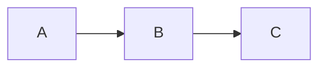
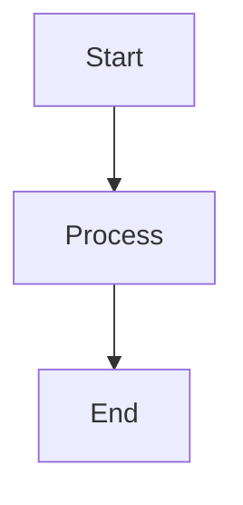

# MarkdownFlow UI Component Library

**React component library for rendering interactive [MarkdownFlow](https://markdownflow.ai) documents with typewriter effects and real-time streaming.**

[MarkdownFlow](https://markdownflow.ai) (also known as MDFlow or markdown-flow) extends standard Markdown with AI to create personalized, interactive pages. Its tagline is **"Write Once, Deliver Personally"**.

<div align="center">

[](https://badge.fury.io/js/markdown-flow-ui)
[](https://opensource.org/licenses/MIT)
[](https://www.typescriptlang.org/)
[](https://storybook.js.org/)

English | [简体中文](README_ZH-CN.md)

</div>

## 🚀 Quick Start

### Install

```bash
npm install markdown-flow-ui
# or
yarn add markdown-flow-ui
# or
pnpm add markdown-flow-ui
```

### Basic Usage

```tsx
import { MarkdownFlow } from "markdown-flow-ui";

function App() {
  return (
    <MarkdownFlow
      initialContentList={[
        {
          content:
            "# Hello World\n\nThis is **MarkdownFlow** with typewriter effect!",
        },
      ]}
      disableTyping={false}
      typingSpeed={30}
    />
  );
}
```

### Interactive Elements

```tsx
import { MarkdownFlow } from "markdown-flow-ui";

function InteractiveExample() {
  const content = `
Choose your language: ?[%{{lang}} English | 中文 | Español]

Your name: ?[%{{name}} Enter your name...]

?[Continue | Cancel]
`;

  return (
    <MarkdownFlow
      initialContentList={[{ content }]}
      onSend={(params) => {
        console.log("User interaction:", params);
        // Handle button clicks and input submissions
      }}
    />
  );
}
```

### Streaming with SSE

```tsx
import { ScrollableMarkdownFlow } from "markdown-flow-ui";
import { useSSE } from "markdown-flow-ui";

function StreamingChat() {
  const [messages, setMessages] = useState([]);

  const { data, isConnected } = useSSE("/api/stream", {
    onMessage: (chunk) => {
      setMessages((prev) => {
        const last = prev[prev.length - 1];
        if (last && !last.isFinished) {
          return [
            ...prev.slice(0, -1),
            { ...last, content: last.content + chunk },
          ];
        }
        return [...prev, { content: chunk, isFinished: false }];
      });
    },
  });

  return (
    <ScrollableMarkdownFlow
      height="500px"
      initialContentList={messages}
      onSend={(params) => {
        // Send user input to backend
        fetch("/api/chat", {
          method: "POST",
          body: JSON.stringify(params),
        });
      }}
    />
  );
}
```

## 📖 API Reference

### Components

#### MarkdownFlow

Main component for rendering markdown with typewriter effects.

```typescript
interface MarkdownFlowProps {
  initialContentList?: ContentItem[];
  customRenderBar?: CustomRenderBarProps;
  onSend?: (content: OnSendContentParams) => void;
  typingSpeed?: number;
  disableTyping?: boolean;
  onBlockComplete?: (blockIndex: number) => void;
}

type ContentItem = {
  content: string;
  isFinished?: boolean;
  defaultInputText?: string;
  defaultButtonText?: string;
  readonly?: boolean;
  customRenderBar?: CustomRenderBarProps;
};

type OnSendContentParams = {
  buttonText?: string;
  variableName?: string;
  inputText?: string;
};
```

**Props:**

- `initialContentList` - Array of content blocks to render
- `typingSpeed` - Typing animation speed (default: 30ms/char)
- `disableTyping` - Disable typewriter effect (default: false)
- `onSend` - Callback for user interactions
- `onBlockComplete` - Called when a block finishes typing
- `customRenderBar` - Custom component for additional UI

**Example:**

```tsx
<MarkdownFlow
  initialContentList={[
    {
      content: "# Welcome\n\nChoose: ?[%{{choice}} A | B | C]",
      isFinished: false,
    },
  ]}
  typingSpeed={50}
  onSend={(params) => {
    if (params.variableName === "choice") {
      console.log("Selected:", params.buttonText);
    }
  }}
/>
```

#### ScrollableMarkdownFlow

Enhanced version with auto-scrolling and scroll management.

```typescript
interface ScrollableMarkdownFlowProps extends MarkdownFlowProps {
  height?: string | number;
  className?: string;
}
```

**Additional Props:**

- `height` - Container height (default: "100%")
- `className` - Additional CSS classes

**Features:**

- Auto-scrolls to bottom on new content
- Shows scroll-to-bottom button when needed
- Smooth scrolling behavior

**Example:**

```tsx
<ScrollableMarkdownFlow
  height="400px"
  initialContentList={messages}
  onSend={handleUserMessage}
  className="chat-container"
/>
```

#### ContentRender

Core component for rendering individual markdown blocks.

```typescript
interface ContentRenderProps {
  content: string;
  customRenderBar?: CustomRenderBarProps;
  onSend?: (content: OnSendContentParams) => void;
  typingSpeed?: number;
  disableTyping?: boolean;
  defaultButtonText?: string;
  defaultInputText?: string;
  readonly?: boolean;
  onTypeFinished?: () => void;
  tooltipMinLength?: number;
}
```

**Props:**

- `content` - Markdown content to render
- `typingSpeed` - Animation speed (default: 30)
- `disableTyping` - Disable animation (default: true)
- `readonly` - Make interactive elements read-only
- `onTypeFinished` - Called when typing completes
- `tooltipMinLength` - Min length for tooltips (default: 10)

**Supported Markdown:**

- Standard markdown (headers, lists, links, etc.)
- GitHub Flavored Markdown (tables, task lists)
- Math expressions with KaTeX: `$E = mc^2$`
- Mermaid diagrams
- Code syntax highlighting
- Custom interactive syntax

**Custom Syntax:**

````markdown
# Buttons

?[Click me]

# Variable inputs

?[%{{userName}} Enter name...]

# Multiple choice

?[%{{color}} Red | Blue | Green]

# Mermaid diagrams


````

````

### Hooks

#### useTypewriter

Manages typewriter animation effects.

```typescript
function useTypewriter(
  content: string,
  speed?: number,
  disabled?: boolean
): {
  displayText: string;
  isComplete: boolean;
  start: () => void;
  pause: () => void;
  reset: () => void;
}
````

**Example:**

```tsx
const { displayText, isComplete, start, pause } = useTypewriter(
  "Hello, World!",
  50,
  false
);

return (
  <div>
    <p>{displayText}</p>
    {!isComplete && <button onClick={pause}>Pause</button>}
  </div>
);
```

#### useScrollToBottom

Auto-scroll management for containers.

```typescript
function useScrollToBottom(
  containerRef: RefObject<HTMLElement>,
  dependencies: any[],
  options?: {
    behavior?: "smooth" | "auto";
    autoScrollOnInit?: boolean;
    scrollDelay?: number;
  }
): {
  showScrollToBottom: boolean;
  handleUserScrollToBottom: () => void;
};
```

**Example:**

```tsx
const containerRef = useRef(null);
const { showScrollToBottom, handleUserScrollToBottom } = useScrollToBottom(
  containerRef,
  [messages.length],
  { behavior: "smooth" }
);

return (
  <div ref={containerRef}>
    {messages.map((msg) => (
      <div key={msg.id}>{msg.text}</div>
    ))}
    {showScrollToBottom && (
      <button onClick={handleUserScrollToBottom}>↓</button>
    )}
  </div>
);
```

#### useSSE

Server-Sent Events integration.

```typescript
function useSSE(
  url: string,
  options?: {
    onMessage?: (data: any) => void;
    onError?: (error: Error) => void;
    onOpen?: () => void;
    reconnect?: boolean;
    reconnectInterval?: number;
  }
): {
  data: any;
  isConnected: boolean;
  error: Error | null;
  close: () => void;
};
```

**Example:**

```tsx
const { data, isConnected, error } = useSSE("/api/stream", {
  onMessage: (chunk) => {
    setContent((prev) => prev + chunk);
  },
  reconnect: true,
  reconnectInterval: 3000,
});
```

### Types

```typescript
// Content item in flow
type ContentItem = {
  content: string;
  isFinished?: boolean;
  defaultInputText?: string;
  defaultButtonText?: string;
  readonly?: boolean;
  customRenderBar?: CustomRenderBarProps;
};

// User interaction parameters
type OnSendContentParams = {
  buttonText?: string;
  variableName?: string;
  inputText?: string;
};

// Custom render bar component
type CustomRenderBarProps = React.ComponentType<{
  content?: string;
  onSend?: (content: OnSendContentParams) => void;
  displayContent: string;
}>;

// All component props are exported
import type {
  MarkdownFlowProps,
  ScrollableMarkdownFlowProps,
  ContentRenderProps,
} from "markdown-flow-ui";
```

### Plugins

#### Built-in Plugins

**Custom Variable Plugin:**

Handles interactive buttons and inputs.

```markdown
?[Button Text] # Simple button
?[%{{variable}} Placeholder...] # Input field
?[%{{choice}} A | B | C] # Multiple choice
```

**Mermaid Plugin:**

Renders diagrams using Mermaid.

````markdown

````

#### Creating Custom Plugins

```typescript
// Define plugin component
const CustomPlugin: React.FC<{ value: string; type?: string }> = ({
  value,
  type = 'default'
}) => {
  return (
    <div className="custom-plugin">
      <span>{type}: {value}</span>
    </div>
  );
};

// Register with ContentRender
const components = {
  'custom-element': CustomPlugin,
};
```

### Styling

The library uses Tailwind CSS and provides customization through:

**CSS Classes:**

```css
.markdown-flow {
}
.content-render {
}
.content-render-table {
}
.content-render-ol {
}
.content-render-ul {
}
.scrollable-markdown-container {
}
.scroll-to-bottom-btn {
}
```

**CSS Variables:**

```css
:root {
  --markdown-flow-primary: #2563eb;
  --markdown-flow-background: #ffffff;
  --markdown-flow-text: #1f2937;
  --markdown-flow-border: #d1d5db;
  --markdown-flow-code-bg: #f3f4f6;
}
```

**Component Classes:**

```tsx
<MarkdownFlow className="my-custom-flow" />
<ScrollableMarkdownFlow className="chat-interface" />
```

## 🧩 Advanced Examples

### Custom Render Bar

```tsx
const CustomBar: CustomRenderBarProps = ({ displayContent, onSend }) => {
  return (
    <div className="flex gap-2 mt-4">
      <button
        onClick={() => onSend({ buttonText: "Regenerate" })}
        className="px-4 py-2 bg-blue-500 text-white rounded"
      >
        Regenerate
      </button>
      <button
        onClick={() => navigator.clipboard.writeText(displayContent)}
        className="px-4 py-2 bg-gray-500 text-white rounded"
      >
        Copy
      </button>
    </div>
  );
};

<MarkdownFlow customRenderBar={CustomBar} initialContentList={messages} />;
```

### Streaming Integration

```tsx
const StreamingChat = () => {
  const [content, setContent] = useState("");

  useSSE("/api/stream", {
    onMessage: (data) => {
      setContent((prev) => prev + data.chunk);
    },
  });

  return (
    <ScrollableMarkdownFlow
      initialContentList={[{ content, isFinished: false }]}
      disableTyping={false}
      typingSpeed={20}
    />
  );
};
```

### Multi-Block Conversation

```tsx
const Conversation = () => {
  const [blocks, setBlocks] = useState([
    { content: "# Assistant\n\nHello! How can I help?", isFinished: true },
    {
      content: "What would you like to know?\n\n?[%{{topic}} Enter topic...]",
      isFinished: false,
    },
  ]);

  const handleSend = (params) => {
    if (params.variableName === "topic") {
      setBlocks((prev) => [
        ...prev,
        { content: `You asked about: ${params.inputText}`, isFinished: false },
      ]);
    }
  };

  return (
    <MarkdownFlow
      initialContentList={blocks}
      onSend={handleSend}
      onBlockComplete={(index) => {
        setBlocks((prev) =>
          prev.map((b, i) => (i === index ? { ...b, isFinished: true } : b))
        );
      }}
    />
  );
};
```

## 🌐 MarkdownFlow Ecosystem

markdown-flow-ui is part of the MarkdownFlow ecosystem for creating personalized, AI-driven interactive documents:

- **[markdown-flow](https://github.com/ai-shifu/markdown-flow)** - The main repository containing homepage, documentation, and interactive playground
- **[markdown-flow-agent-py](https://github.com/ai-shifu/markdown-flow-agent-py)** - Python agent for transforming MarkdownFlow documents into personalized content
- **[markdown-it-flow](https://github.com/ai-shifu/markdown-it-flow)** - markdown-it plugin to parse and render MarkdownFlow syntax
- **[remark-flow](https://github.com/ai-shifu/remark-flow)** - Remark plugin to parse and process MarkdownFlow syntax in React applications

## 💖 Sponsors

<div align="center">
  <a href="https://ai-shifu.com">
    
  </a>
  <p><strong><a href="https://ai-shifu.com">AI-Shifu.com</a></strong></p>
  <p>AI-powered personalized learning platform</p>
</div>

## 📄 License

MIT License - see [LICENSE](LICENSE) file for details.

## 🙏 Acknowledgments

- [React Markdown](https://github.com/remarkjs/react-markdown) for markdown processing
- [Mermaid](https://mermaid.js.org/) for diagram rendering
- [Highlight.js](https://highlightjs.org/) for syntax highlighting
- [Tailwind CSS](https://tailwindcss.com/) for styling
- [Radix UI](https://www.radix-ui.com/) for accessible components

## 📞 Support

- 📖 [Documentation](https://github.com/ai-shifu/markdown-flow-ui#readme)
- 🐛 [Issue Tracker](https://github.com/ai-shifu/markdown-flow-ui/issues)
- 💬 [Discussions](https://github.com/ai-shifu/markdown-flow-ui/discussions)
