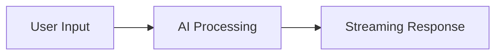

<div align="center">
  <h1>Markdown Flow UI</h1>
  <p><strong>A React library designed for conversational AI applications with streaming typewriter effects and interactive components.</strong></p>

  English | [简体中文](README_ZH-CN.md)

  [](https://badge.fury.io/js/markdown-flow-ui)
  [](https://opensource.org/licenses/MIT)
  [](https://www.typescriptlang.org/)
  [](https://storybook.js.org/)

</div>

Perfect for building ChatGPT-like interfaces, AI assistants, and real-time conversation experiences. This library powers the conversational UI components used in [AI-Shifu](https://ai-shifu.com), an AI-driven educational platform.

## 🤝 Part of the AI-Shifu Ecosystem

Markdown Flow UI is the core UI component library that powers [AI-Shifu](https://github.com/ai-shifu/ai-shifu), an open-source conversational AI platform. While this library can be used standalone, it was specifically designed to create personalized, interactive learning experiences in AI-driven applications.

**🌟 See it in action:** Visit [AI-Shifu.com](https://ai-shifu.com) to experience the library in a real-world educational platform.

## 📚 Documentation

- **[AGENTS.md](./AGENTS.md)** - Complete guide for AI agents and development (Claude Code, Codex, etc.)

## ✨ Why Choose Markdown Flow UI?

Unlike standard markdown renderers, Markdown Flow UI is specifically built for **conversational AI interfaces**:

- 🎭 **Streaming Typewriter Effects** - Text appears character by character, just like ChatGPT
- 🎯 **Interactive Components** - Buttons and form inputs embedded directly in markdown
- 🔄 **Server-Sent Events (SSE) Support** - Real-time streaming from your AI backend
- 📱 **Conversation Flow Management** - Handle multiple message blocks with auto-scroll
- 🎨 **Zero Configuration** - Works out of the box with beautiful defaults

## 🎬 See It In Action

_[TODO: Add GIF demonstrations of typewriter effects and interactive components]_

## 🚀 Quick Start

### Install

```bash
npm install markdown-flow-ui
```

### Basic Streaming Text

```tsx
import { MarkdownFlow } from "markdown-flow-ui";

function ChatMessage() {
  const [content, setContent] = useState("");

  // Simulate streaming from AI
  useEffect(() => {
    const text =
      "# Hello! 👋\n\nI'm an AI assistant. How can I **help** you today?";
    let i = 0;
    const timer = setInterval(() => {
      setContent(text.slice(0, i++));
      if (i > text.length) clearInterval(timer);
    }, 50);
  }, []);

  return (
    <MarkdownFlow initialContentList={[{ content }]} disableTyping={false} />
  );
}
```

**Result:** Text appears with a smooth typewriter animation, supporting full markdown formatting.

### Interactive Components

```tsx
import { MarkdownFlow } from "markdown-flow-ui";

function InteractiveChat() {
  const content = `
Choose your preferred language:

?[%{{language}} JavaScript | Python | TypeScript | Go]

Click to continue: ?[Let's Go!]
`;

  return (
    <MarkdownFlow
      initialContentList={[{ content }]}
      onSend={(data) => {
        console.log("User selected:", data.buttonText);
        // Handle user interaction
      }}
    />
  );
}
```

**Result:** Renders clickable buttons that trigger callbacks when pressed.

### Real-time SSE Streaming

```tsx
import { ScrollableMarkdownFlow } from "markdown-flow-ui";

function LiveChat() {
  return (
    <ScrollableMarkdownFlow
      initialContentList={[
        { content: "## AI Assistant\n\nConnecting to server..." },
      ]}
      onSend={(data) => {
        // Send user input to your AI backend
        fetch("/api/chat", {
          method: "POST",
          body: JSON.stringify({ message: data.inputText }),
        });
      }}
    />
  );
}
```

**Result:** A complete chat interface with auto-scrolling and real-time message streaming.

## 🧩 Core Components

### MarkdownFlow

The main component for rendering markdown with typewriter effects.

**Key Props:**

- `initialContentList` - Array of message objects
- `disableTyping` - Toggle typewriter animation
- `onSend` - Handle user interactions

### ScrollableMarkdownFlow

Enhanced version with conversation management and auto-scrolling.

**Key Props:**

- `initialContentList` - Conversation history
- `onSend` - Process user inputs
- Additional scroll and SSE management

### MarkdownFlowEditor

Code editor with markdown preview and flow syntax support.

**Key Props:**

- `value` - Editor content
- `onChange` - Content change handler
- `readOnly` - Editor mode

## 🎯 When to Use This Library

**Perfect for:**

- ✅ ChatGPT-style interfaces
- ✅ AI assistant applications
- ✅ Real-time chat systems
- ✅ Interactive documentation
- ✅ Educational platforms with guided content

**Not ideal for:**

- ❌ Static documentation sites
- ❌ Simple blog content
- ❌ Non-interactive markdown display

## 📖 Advanced Features

### Custom Markdown Syntax

**Interactive Buttons:**

```markdown
Click here: ?[Button Text]
```

**Variable Inputs:**

```markdown
Enter your name: ?[%{{userName}} Type your name here...]
Choose option: ?[%{{choice}} Option A | Option B | Option C]
```

**Mermaid Diagrams:**

````markdown

````

### Styling & Customization

The library uses Tailwind CSS classes and provides extensive customization options through props and CSS variables.

### TypeScript Support

Full TypeScript support with comprehensive type definitions for all components and props.

## 🛠 Development

### Prerequisites

- Node.js 18+
- pnpm (recommended) or npm

### Setup

```bash
git clone https://github.com/ai-shifu/markdown-flow-ui.git
cd markdown-flow-ui
pnpm install
pnpm storybook
```

Open [http://localhost:6006](http://localhost:6006) to view the interactive documentation.

### Scripts

| Script | Description |
|--------|-------------|
| `pnpm dev` | Next.js development server for testing |
| `pnpm storybook` | Interactive component documentation |
| `pnpm build` | Build library for production |
| `pnpm build-storybook` | Build static Storybook documentation |
| `pnpm lint` | ESLint code quality checks |
| `pnpm format` | Prettier code formatting |

### Integration with AI-Shifu

This library is actively used in the [AI-Shifu project](https://github.com/ai-shifu/ai-shifu). To see how it integrates with a full conversational AI platform:

```bash
# Clone and setup AI-Shifu
git clone https://github.com/ai-shifu/ai-shifu.git
cd ai-shifu/docker
cp .env.example.minimal .env
# Configure your .env file
docker compose up -d
```

## 🤝 Contributing

We welcome contributions! Please see our [Contributing Guide](CONTRIBUTING.md) for details.

1. Fork the repository
2. Create your feature branch (`git checkout -b feature/amazing-feature`)
3. Commit your changes (`git commit -m 'Add some amazing feature'`)
4. Push to the branch (`git push origin feature/amazing-feature`)
5. Open a Pull Request

## 📄 License

This project is licensed under the MIT License - see the [LICENSE](LICENSE) file for details.

## 🙏 Acknowledgments

- [React Markdown](https://github.com/remarkjs/react-markdown) for markdown processing
- [Mermaid](https://mermaid.js.org/) for diagram rendering
- [Highlight.js](https://highlightjs.org/) for syntax highlighting
- [Tailwind CSS](https://tailwindcss.com/) for styling
- [Radix UI](https://www.radix-ui.com/) for accessible components

## 📞 Support

- 📖 [Documentation](https://github.com/ai-shifu/markdown-flow-ui#readme)
- 🐛 [Issue Tracker](https://github.com/ai-shifu/markdown-flow-ui/issues)
- 💬 [Discussions](https://github.com/ai-shifu/markdown-flow-ui/discussions)

---

Made with ❤️ for the conversational AI community
