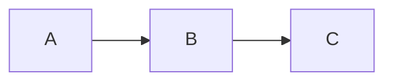
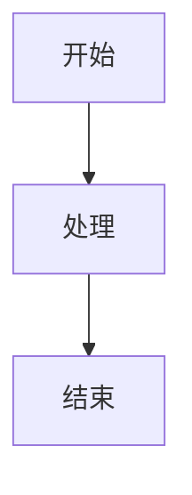

# MarkdownFlow UI 组件库

**用于渲染交互式 [MarkdownFlow](https://markdownflow.ai) 文档的 React 组件库，具有打字机效果和实时流式传输功能。**

MarkdownFlow（也称为 MDFlow 或 markdown-flow）通过 AI 扩展了标准 Markdown，用于创建个性化的交互式页面。我们的口号是：**“一次创作，千人千面”**。

<div align="center">

[](https://badge.fury.io/js/markdown-flow-ui)
[](https://opensource.org/licenses/MIT)
[](https://www.typescriptlang.org/)
[](https://storybook.js.org/)

[English](README.md) | 简体中文

</div>

## 🚀 快速开始

### 安装

```bash
npm install markdown-flow-ui
# 或
yarn add markdown-flow-ui
# 或
pnpm add markdown-flow-ui
```

### 基础用法

```tsx
import { MarkdownFlow } from "markdown-flow-ui";

function App() {
  return (
    <MarkdownFlow
      initialContentList={[
        { content: "# Hello World\n\n这是带有打字机效果的 **MarkdownFlow**！" },
      ]}
      disableTyping={false}
      typingSpeed={30}
    />
  );
}
```

### 交互式元素

```tsx
import { MarkdownFlow } from "markdown-flow-ui";

function InteractiveExample() {
  const content = `
选择您的语言：?[%{{lang}} English | 中文 | Español]

您的姓名：?[%{{name}} 输入您的姓名...]

?[继续 | 取消]
`;

  return (
    <MarkdownFlow
      initialContentList={[{ content }]}
      onSend={(params) => {
        console.log("用户交互：", params);
        // 处理按钮点击和输入提交
      }}
    />
  );
}
```

### SSE 流式传输

```tsx
import { ScrollableMarkdownFlow } from "markdown-flow-ui";
import { useSSE } from "markdown-flow-ui";

function StreamingChat() {
  const [messages, setMessages] = useState([]);

  const { data, isConnected } = useSSE("/api/stream", {
    onMessage: (chunk) => {
      setMessages((prev) => {
        const last = prev[prev.length - 1];
        if (last && !last.isFinished) {
          return [
            ...prev.slice(0, -1),
            { ...last, content: last.content + chunk },
          ];
        }
        return [...prev, { content: chunk, isFinished: false }];
      });
    },
  });

  return (
    <ScrollableMarkdownFlow
      height="500px"
      initialContentList={messages}
      onSend={(params) => {
        // 发送用户输入到后端
        fetch("/api/chat", {
          method: "POST",
          body: JSON.stringify(params),
        });
      }}
    />
  );
}
```

## 📖 API 参考

### 组件

#### MarkdownFlow

用于渲染带有打字机效果的 markdown 的主要组件。

```typescript
interface MarkdownFlowProps {
  initialContentList?: ContentItem[];
  customRenderBar?: CustomRenderBarProps;
  onSend?: (content: OnSendContentParams) => void;
  typingSpeed?: number;
  disableTyping?: boolean;
  onBlockComplete?: (blockIndex: number) => void;
}

type ContentItem = {
  content: string;
  isFinished?: boolean;
  defaultInputText?: string;
  defaultButtonText?: string;
  readonly?: boolean;
  customRenderBar?: CustomRenderBarProps;
};

type OnSendContentParams = {
  buttonText?: string;
  variableName?: string;
  inputText?: string;
};
```

**属性：**

- `initialContentList` - 要渲染的内容块数组
- `typingSpeed` - 打字动画速度（默认：30ms/字符）
- `disableTyping` - 禁用打字机效果（默认：false）
- `onSend` - 用户交互的回调
- `onBlockComplete` - 当块完成打字时调用
- `customRenderBar` - 用于附加 UI 的自定义组件

**示例：**

```tsx
<MarkdownFlow
  initialContentList={[
    {
      content: "# 欢迎\n\n选择：?[%{{choice}} A | B | C]",
      isFinished: false,
    },
  ]}
  typingSpeed={50}
  onSend={(params) => {
    if (params.variableName === "choice") {
      console.log("已选择：", params.buttonText);
    }
  }}
/>
```

#### ScrollableMarkdownFlow

具有自动滚动和滚动管理的增强版本。

```typescript
interface ScrollableMarkdownFlowProps extends MarkdownFlowProps {
  height?: string | number;
  className?: string;
}
```

**附加属性：**

- `height` - 容器高度（默认："100%"）
- `className` - 附加 CSS 类

**功能：**

- 新内容时自动滚动到底部
- 需要时显示滚动到底部按钮
- 平滑滚动行为

**示例：**

```tsx
<ScrollableMarkdownFlow
  height="400px"
  initialContentList={messages}
  onSend={handleUserMessage}
  className="chat-container"
/>
```

#### ContentRender

用于渲染单个 markdown 块的核心组件。

```typescript
interface ContentRenderProps {
  content: string;
  customRenderBar?: CustomRenderBarProps;
  onSend?: (content: OnSendContentParams) => void;
  typingSpeed?: number;
  disableTyping?: boolean;
  defaultButtonText?: string;
  defaultInputText?: string;
  readonly?: boolean;
  onTypeFinished?: () => void;
  tooltipMinLength?: number;
}
```

**属性：**

- `content` - 要渲染的 Markdown 内容
- `typingSpeed` - 动画速度（默认：30）
- `disableTyping` - 禁用动画（默认：true）
- `readonly` - 使交互元素只读
- `onTypeFinished` - 打字完成时调用
- `tooltipMinLength` - 工具提示的最小长度（默认：10）

**支持的 Markdown：**

- 标准 markdown（标题、列表、链接等）
- GitHub Flavored Markdown（表格、任务列表）
- KaTeX 数学表达式：`$E = mc^2$`
- Mermaid 图表
- 代码语法高亮
- 自定义交互式语法

**自定义语法：**

````markdown
# 按钮

?[点击我]

# 变量输入

?[%{{userName}} 输入姓名...]

# 多选

?[%{{color}} 红色 | 蓝色 | 绿色]

# Mermaid 图表


````

````

### Hooks

#### useTypewriter

管理打字机动画效果。

```typescript
function useTypewriter(
  content: string,
  speed?: number,
  disabled?: boolean
): {
  displayText: string;
  isComplete: boolean;
  start: () => void;
  pause: () => void;
  reset: () => void;
}
````

**示例：**

```tsx
const { displayText, isComplete, start, pause } = useTypewriter(
  "Hello, World!",
  50,
  false
);

return (
  <div>
    <p>{displayText}</p>
    {!isComplete && <button onClick={pause}>暂停</button>}
  </div>
);
```

#### useScrollToBottom

容器的自动滚动管理。

```typescript
function useScrollToBottom(
  containerRef: RefObject<HTMLElement>,
  dependencies: any[],
  options?: {
    behavior?: "smooth" | "auto";
    autoScrollOnInit?: boolean;
    scrollDelay?: number;
  }
): {
  showScrollToBottom: boolean;
  handleUserScrollToBottom: () => void;
};
```

**示例：**

```tsx
const containerRef = useRef(null);
const { showScrollToBottom, handleUserScrollToBottom } = useScrollToBottom(
  containerRef,
  [messages.length],
  { behavior: "smooth" }
);

return (
  <div ref={containerRef}>
    {messages.map((msg) => (
      <div key={msg.id}>{msg.text}</div>
    ))}
    {showScrollToBottom && (
      <button onClick={handleUserScrollToBottom}>↓</button>
    )}
  </div>
);
```

#### useSSE

服务器发送事件集成。

```typescript
function useSSE(
  url: string,
  options?: {
    onMessage?: (data: any) => void;
    onError?: (error: Error) => void;
    onOpen?: () => void;
    reconnect?: boolean;
    reconnectInterval?: number;
  }
): {
  data: any;
  isConnected: boolean;
  error: Error | null;
  close: () => void;
};
```

**示例：**

```tsx
const { data, isConnected, error } = useSSE("/api/stream", {
  onMessage: (chunk) => {
    setContent((prev) => prev + chunk);
  },
  reconnect: true,
  reconnectInterval: 3000,
});
```

### 类型

```typescript
// 流中的内容项
type ContentItem = {
  content: string;
  isFinished?: boolean;
  defaultInputText?: string;
  defaultButtonText?: string;
  readonly?: boolean;
  customRenderBar?: CustomRenderBarProps;
};

// 用户交互参数
type OnSendContentParams = {
  buttonText?: string;
  variableName?: string;
  inputText?: string;
};

// 自定义渲染栏组件
type CustomRenderBarProps = React.ComponentType<{
  content?: string;
  onSend?: (content: OnSendContentParams) => void;
  displayContent: string;
}>;

// 所有组件属性都已导出
import type {
  MarkdownFlowProps,
  ScrollableMarkdownFlowProps,
  ContentRenderProps,
} from "markdown-flow-ui";
```

### 插件

#### 内置插件

**自定义变量插件：**

处理交互式按钮和输入。

```markdown
?[按钮文本] # 简单按钮
?[%{{variable}} 占位符...] # 输入字段
?[%{{choice}} A | B | C] # 多选
```

**Mermaid 插件：**

使用 Mermaid 渲染图表。

````markdown

````

#### 创建自定义插件

```typescript
// 定义插件组件
const CustomPlugin: React.FC<{ value: string; type?: string }> = ({
  value,
  type = 'default'
}) => {
  return (
    <div className="custom-plugin">
      <span>{type}: {value}</span>
    </div>
  );
};

// 注册到 ContentRender
const components = {
  'custom-element': CustomPlugin,
};
```

### 样式

该库使用 Tailwind CSS 并通过以下方式提供自定义：

**CSS 类：**

```css
.markdown-flow {
}
.content-render {
}
.content-render-table {
}
.content-render-ol {
}
.content-render-ul {
}
.scrollable-markdown-container {
}
.scroll-to-bottom-btn {
}
```

**CSS 变量：**

```css
:root {
  --markdown-flow-primary: #2563eb;
  --markdown-flow-background: #ffffff;
  --markdown-flow-text: #1f2937;
  --markdown-flow-border: #d1d5db;
  --markdown-flow-code-bg: #f3f4f6;
}
```

**组件类：**

```tsx
<MarkdownFlow className="my-custom-flow" />
<ScrollableMarkdownFlow className="chat-interface" />
```

## 🧩 高级示例

### 自定义渲染栏

```tsx
const CustomBar: CustomRenderBarProps = ({ displayContent, onSend }) => {
  return (
    <div className="flex gap-2 mt-4">
      <button
        onClick={() => onSend({ buttonText: "重新生成" })}
        className="px-4 py-2 bg-blue-500 text-white rounded"
      >
        重新生成
      </button>
      <button
        onClick={() => navigator.clipboard.writeText(displayContent)}
        className="px-4 py-2 bg-gray-500 text-white rounded"
      >
        复制
      </button>
    </div>
  );
};

<MarkdownFlow customRenderBar={CustomBar} initialContentList={messages} />;
```

### 流式集成

```tsx
const StreamingChat = () => {
  const [content, setContent] = useState("");

  useSSE("/api/stream", {
    onMessage: (data) => {
      setContent((prev) => prev + data.chunk);
    },
  });

  return (
    <ScrollableMarkdownFlow
      initialContentList={[{ content, isFinished: false }]}
      disableTyping={false}
      typingSpeed={20}
    />
  );
};
```

### 多块对话

```tsx
const Conversation = () => {
  const [blocks, setBlocks] = useState([
    { content: "# 助手\n\n你好！我能帮你什么？", isFinished: true },
    {
      content: "你想了解什么？\n\n?[%{{topic}} 输入主题...]",
      isFinished: false,
    },
  ]);

  const handleSend = (params) => {
    if (params.variableName === "topic") {
      setBlocks((prev) => [
        ...prev,
        { content: `你询问了：${params.inputText}`, isFinished: false },
      ]);
    }
  };

  return (
    <MarkdownFlow
      initialContentList={blocks}
      onSend={handleSend}
      onBlockComplete={(index) => {
        setBlocks((prev) =>
          prev.map((b, i) => (i === index ? { ...b, isFinished: true } : b))
        );
      }}
    />
  );
};
```

## 🌐 MarkdownFlow 生态系统

markdown-flow-ui 是 MarkdownFlow 生态系统的一部分，用于创建个性化、AI 驱动的交互式文档：

- **[markdown-flow](https://github.com/ai-shifu/markdown-flow)** - 包含主页、文档和交互式 playground 的主仓库
- **[markdown-flow-agent-py](https://github.com/ai-shifu/markdown-flow-agent-py)** - 用于将 MarkdownFlow 文档转换为个性化内容的 Python 代理
- **[markdown-it-flow](https://github.com/ai-shifu/markdown-it-flow)** - 用于解析和渲染 MarkdownFlow 语法的 markdown-it 插件
- **[remark-flow](https://github.com/ai-shifu/remark-flow)** - 用于在 React 应用中解析和处理 MarkdownFlow 语法的 Remark 插件

## 💖 赞助商

<div align="center">
  <a href="https://ai-shifu.cn">
    
  </a>
  <p><strong><a href="https://ai-shifu.cn">AI-Shifu.cn</a></strong></p>
  <p>AI 驱动的个性化学习平台</p>
</div>

## 📄 许可证

MIT 许可证 - 详见 [LICENSE](LICENSE) 文件。

## 🙏 致谢

- [React Markdown](https://github.com/remarkjs/react-markdown) 用于 markdown 处理
- [Mermaid](https://mermaid.js.org/) 用于图表渲染
- [Highlight.js](https://highlightjs.org/) 用于语法高亮
- [Tailwind CSS](https://tailwindcss.com/) 用于样式
- [Radix UI](https://www.radix-ui.com/) 用于可访问的组件

## 📞 支持

- 📖 [文档](https://github.com/ai-shifu/markdown-flow-ui#readme)
- 🐛 [问题跟踪](https://github.com/ai-shifu/markdown-flow-ui/issues)
- 💬 [讨论](https://github.com/ai-shifu/markdown-flow-ui/discussions)
