<div align="center">
  <h1>Markdown Flow UI</h1>
  <p><strong>专为对话式AI应用设计的React组件库，具有流式打字机效果和交互组件。</strong></p>

  [English](README.md) | 简体中文

  [](https://badge.fury.io/js/markdown-flow-ui)
  [](https://opensource.org/licenses/MIT)
  [](https://www.typescriptlang.org/)
  [](https://storybook.js.org/)

</div>

完美适用于构建类ChatGPT界面、AI助手和实时对话体验。这个库为[AI-Shifu](https://ai-shifu.com)（AI驱动的教育平台）提供对话式UI组件支持。

## 🤝 AI师傅生态系统的一部分

Markdown Flow UI 是为 [AI-Shifu](https://github.com/ai-shifu/ai-shifu) 提供支持的核心UI组件库，AI师傅是一个开源的对话式AI平台。虽然这个库可以独立使用，但它专门为在AI驱动的应用程序中创建个性化、交互式学习体验而设计。

**🌟 实际应用展示：** 访问 [AI-Shifu.com](https://ai-shifu.com) 体验该库在真实教育平台中的应用。

## 📚 文档

- **[AGENTS.md](./AGENTS.md)** - AI代理和开发完整指南（Claude Code、Codex等）

## ✨ 为什么选择 Markdown Flow UI？

与标准markdown渲染器不同，Markdown Flow UI 专门为**对话式AI界面**而构建：

- 🎭 **流式打字机效果** - 文本逐字符显示，就像ChatGPT一样
- 🎯 **交互式组件** - 按钮和表单输入直接嵌入到markdown中
- 🔄 **服务端发送事件（SSE）支持** - 来自AI后端的实时流式传输
- 📱 **对话流程管理** - 处理多个消息块，支持自动滚动
- 🎨 **零配置** - 开箱即用，具有精美的默认样式

## 🎬 实际效果展示

_[待添加：打字机效果和交互组件的GIF演示]_

## 🚀 快速开始

### 安装

```bash
npm install markdown-flow-ui
```

### 基础流式文本

```tsx
import { MarkdownFlow } from "markdown-flow-ui";

function ChatMessage() {
  const [content, setContent] = useState("");

  // 模拟来自AI的流式传输
  useEffect(() => {
    const text =
      "# 你好！ 👋\n\n我是AI助手。今天我可以为您**做些什么**呢？";
    let i = 0;
    const timer = setInterval(() => {
      setContent(text.slice(0, i++));
      if (i > text.length) clearInterval(timer);
    }, 50);
  }, []);

  return (
    <MarkdownFlow initialContentList={[{ content }]} disableTyping={false} />
  );
}
```

**效果：** 文本以流畅的打字机动画显示，支持完整的markdown格式。

### 交互式组件

```tsx
import { MarkdownFlow } from "markdown-flow-ui";

function InteractiveChat() {
  const content = `
请选择您喜欢的编程语言：

?[%{{language}} JavaScript | Python | TypeScript | Go]

点击继续：?[开始吧！]
`;

  return (
    <MarkdownFlow
      initialContentList={[{ content }]}
      onSend={(data) => {
        console.log("用户选择：", data.buttonText);
        // 处理用户交互
      }}
    />
  );
}
```

**效果：** 渲染可点击按钮，按下时触发回调函数。

### 实时SSE流式传输

```tsx
import { ScrollableMarkdownFlow } from "markdown-flow-ui";

function LiveChat() {
  return (
    <ScrollableMarkdownFlow
      initialContentList={[
        { content: "## AI助手\n\n正在连接服务器..." },
      ]}
      onSend={(data) => {
        // 将用户输入发送到AI后端
        fetch("/api/chat", {
          method: "POST",
          body: JSON.stringify({ message: data.inputText }),
        });
      }}
    />
  );
}
```

**效果：** 完整的聊天界面，支持自动滚动和实时消息流式传输。

## 🧩 核心组件

### MarkdownFlow

用于渲染带有打字机效果的markdown的主要组件。

**关键属性：**

- `initialContentList` - 消息对象数组
- `disableTyping` - 切换打字机动画
- `onSend` - 处理用户交互

### ScrollableMarkdownFlow

增强版本，具有对话管理和自动滚动功能。

**关键属性：**

- `initialContentList` - 对话历史
- `onSend` - 处理用户输入
- 附加的滚动和SSE管理

### MarkdownFlowEditor

支持markdown预览和流程语法的代码编辑器。

**关键属性：**

- `value` - 编辑器内容
- `onChange` - 内容变更处理器
- `readOnly` - 编辑器模式

## 🎯 何时使用这个库

**最适合：**

- ✅ ChatGPT风格的界面
- ✅ AI助手应用程序
- ✅ 实时聊天系统
- ✅ 交互式文档
- ✅ 具有引导内容的教育平台

**不太适合：**

- ❌ 静态文档网站
- ❌ 简单博客内容
- ❌ 非交互式markdown显示

## 📖 高级功能

### 自定义Markdown语法

**交互式按钮：**

```markdown
点击这里：?[按钮文本]
```

**变量输入：**

```markdown
输入您的姓名：?[%{{userName}} 请输入您的姓名...]
选择选项：?[%{{choice}} 选项A | 选项B | 选项C]
```

**Mermaid图表：**

````markdown

```mermaid
graph LR
    A[用户输入] --> B[AI处理]
    B --> C[流式响应]
```

````

### 样式和自定义

该库使用Tailwind CSS类，通过属性和CSS变量提供广泛的自定义选项。

### TypeScript支持

完整的TypeScript支持，为所有组件和属性提供全面的类型定义。

## 🛠 开发

### 前置要求

- Node.js 18+
- pnpm（推荐）或 npm

### 设置

```bash
git clone https://github.com/ai-shifu/markdown-flow-ui.git
cd markdown-flow-ui
pnpm install
pnpm storybook
```

打开 [http://localhost:6006](http://localhost:6006) 查看交互式文档。

### 脚本命令

| 脚本 | 描述 |
|------|------|
| `pnpm dev` | 用于测试的Next.js开发服务器 |
| `pnpm storybook` | 交互式组件文档 |
| `pnpm build` | 构建用于生产的库 |
| `pnpm build-storybook` | 构建静态Storybook文档 |
| `pnpm lint` | ESLint代码质量检查 |
| `pnpm format` | Prettier代码格式化 |

### 与AI师傅的集成

该库在[AI师傅项目](https://github.com/ai-shifu/ai-shifu)中得到积极使用。要了解它如何与完整的对话式AI平台集成：

```bash
# 克隆并设置AI师傅
git clone https://github.com/ai-shifu/ai-shifu.git
cd ai-shifu/docker
cp .env.example.minimal .env
# 配置您的.env文件
docker compose up -d
```


## 📄 许可证

该项目采用MIT许可证 - 有关详情请参阅[LICENSE](LICENSE)文件。

## 🙏 致谢

- [React Markdown](https://github.com/remarkjs/react-markdown) 用于markdown处理
- [Mermaid](https://mermaid.js.org/) 用于图表渲染
- [Highlight.js](https://highlightjs.org/) 用于语法高亮
- [Tailwind CSS](https://tailwindcss.com/) 用于样式
- [Radix UI](https://www.radix-ui.com/) 用于可访问的组件

## 📞 支持

- 📖 [文档](https://github.com/ai-shifu/markdown-flow-ui#readme)
- 🐛 [问题跟踪](https://github.com/ai-shifu/markdown-flow-ui/issues)
- 💬 [讨论](https://github.com/ai-shifu/markdown-flow-ui/discussions)

---

为对话式AI社区用❤️制作
